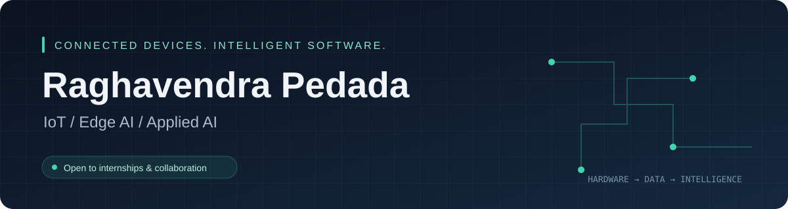

 

## Hi, I'm Raghavendra

I'm a **Computer Science engineering student** at **Alva's Institute of Engineering and Technology (VTU)**, specializing in **IoT, Cybersecurity and Blockchain**, and graduating in **2027**.

I build projects that connect devices, data and intelligent software—from simulated IoT monitoring to document Q&A and computational benchmarking. My current focus is **edge AI**, **RAG systems** and practical applications of **LLM APIs**.

- **Currently building:** an Edge-AI Smart Mirror using Raspberry Pi 4B, MediaPipe, TensorFlow Lite and OpenCV for health and wellness monitoring.
- **Based in:** Mangalore / Visakhapatnam, India.
- **Open to:** internships and collaboration in IoT, embedded systems and applied AI.

## Selected projects

| Project | What it does | Core technologies |
| :--- | :--- | :--- |
| **[HashPilot](https://github.com/RaghavendraPedada-1765/HashPilot)** | Compares four hash-solving strategies, predicts a strategy with machine learning, and presents live telemetry and PDF reports. | Python · FastAPI · React · Random Forest · WebSockets |
| **[AQI IoT Station](https://github.com/RaghavendraPedada-1765/AQI-IoT-Station)** | Simulates environmental sensors and streams readings through MQTT to a Node-RED dashboard. No hardware required. | Python · MQTT · HiveMQ · Node-RED |
| **[Cosmic RAG System](https://github.com/RaghavendraPedada-1765/Cosmic-RAG-System)** | Lets users upload PDFs and ask questions using local embeddings, vector search and an LLM. | Streamlit · LangChain · FAISS · Hugging Face · Groq |
| **[AI Resume Analyzer](https://github.com/RaghavendraPedada-1765/AI_ATS_Checker)** | Compares resumes with job descriptions and provides scoring, keyword analysis and structured feedback. | Python · Streamlit · spaCy · Gemini · Groq |

[Browse all repositories →](https://github.com/RaghavendraPedada-1765?tab=repositories)

## Tools I work with

**Languages**  
Python · C · JavaScript · HTML · CSS

**IoT & embedded systems**  
Raspberry Pi · ESP32 · Arduino · MQTT · Node-RED

**AI & data**  
TensorFlow Lite · MediaPipe · OpenCV · LangChain · FAISS · Streamlit

**Applications & development**  
FastAPI · React · Node.js · Git · Linux · Docker

## Experience & learning

- **Hindustan Shipyard Limited, Visakhapatnam** — internship focused on disaster management and navigation systems.
- **TATA cybersecurity micro-internship** — cybersecurity learning and practical exposure.
- **IBM / Coursera** — CI/CD and OpenShift pipeline certification.
- **Cognizant Technoverse Hackathon 2026** — worked on the “Invisible Patient” ward system.

## Let's connect

I'm interested in opportunities to build useful systems and learn alongside other engineers.

**[Connect on LinkedIn](https://www.linkedin.com/in/raghavendra-pedada-baa349356/)** · **[Email me](mailto:raghavendrapedadaa@gmail.com)**

Interested in connected devices, edge intelligence, or an AI project? Let's build something useful.
